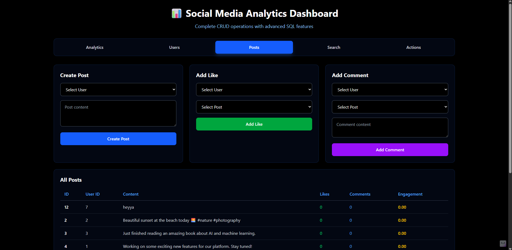
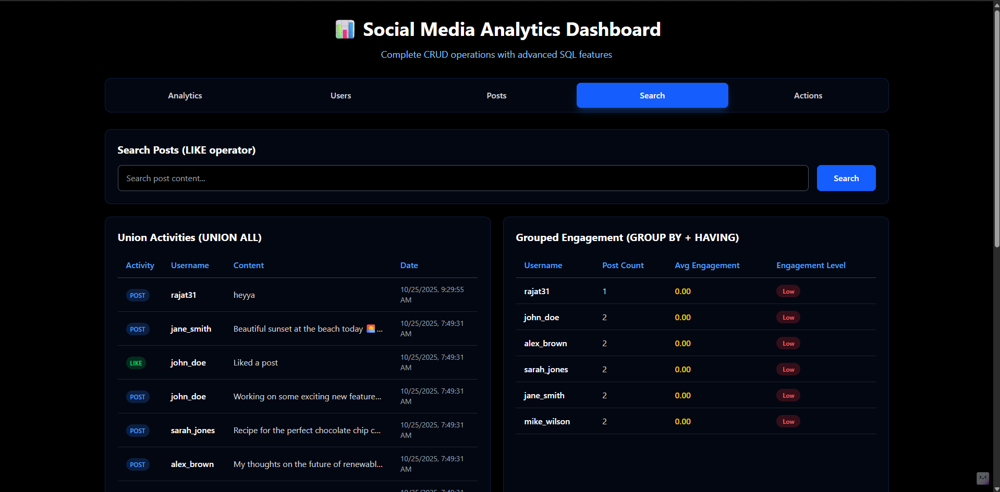
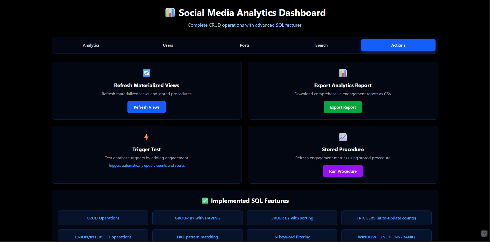

# 🚀 Social Media Analytics — README

A compact, developer-friendly README for the Social Media Analytics project.  
This repo demonstrates a PostgreSQL schema for tracking social posts, likes, comments, and analytics, and exposes them via a FastAPI backend. It highlights advanced SQL features (window functions, materialized views, triggers, stored procedures) and includes sample query outputs to validate analytics. ✨

---
[](https://social-media-analytics-liard.vercel.app/)  

### 🌐 Live demo: https://social-media-analytics-liard.vercel.app/
---
## 📚 Table of contents
- Project overview
- Schema summary
- Key SQL queries, significance, and example outputs
- FastAPI endpoints (overview)
- Usage & setup
- Troubleshooting & notes

---

## 🧭 Project overview

Features
- 👥 User CRUD (create, read, update, delete)
- 📝 Post creation & listing
- ❤️ Likes and 💬 comments with triggers keeping aggregate counts up-to-date
- 📊 Analytical views and a materialized view for fast reads
- 📁 CSV export for reports
- 🔁 Endpoint to refresh materialized views & engagement metrics

Advanced SQL features used
- Triggers, Stored Procedures, Materialized Views
- Window functions: RANK(), DENSE_RANK(), PERCENT_RANK()
- UNION / INTERSECT, GROUP BY with HAVING
- LIKE searches and IN filters
- Views and JOINS

---

## 🗂️ Schema summary (short)

- users (id, username, email, full_name, created_at, updated_at)
- posts (id, user_id, content, like_count, comment_count, engagement_score, created_at, updated_at)
- likes (id, post_id, user_id, created_at)
- comments (id, post_id, user_id, content, created_at)
- Views:
  - top_posts
  - user_engagement_summary
- Materialized view:
  - post_engagement_mv
- Triggers:
  - update_post_like_count — updates posts.like_count and engagement_score
  - update_post_comment_count — updates posts.comment_count and engagement_score
- Stored procedure:
  - refresh_engagement_metrics()

---

## 🔍 Key SQL queries, why they matter, and sample outputs

Below you'll find the main queries in code blocks, a short explanation (significance), and sample table outputs based on the seeded dataset. The outputs assume like_count and comment_count are up-to-date (triggers present or refresh procedure run).

1) Top posts by engagement (VIEW: top_posts)

SQL
```sql
SELECT * FROM top_posts LIMIT 10;
```

Significance
- Surfaces the most engaging content by blending likes and comments.
- Useful for leaderboards, dashboards, or content promotion.
- Implemented as a view so the UI queries a simple endpoint.

Sample output (columns: post_id, username, content, like_count, comment_count, engagement_score, rank):

| post_id | username    | content (preview)                                         | like_count | comment_count | engagement_score | rank |
|--------:|-------------|-----------------------------------------------------------|-----------:|--------------:|-----------------:|-----:|
| 1       | john_doe    | Just launched my new startup! Excited for this journey... | 4          | 2             | 3.20             | 1    |
| 5       | alex_brown  | Recipe for the perfect chocolate chip cookies: ...        | 4          | 1             | 2.80             | 2    |
| 2       | jane_smith  | Beautiful sunset at the beach today 🌅                     | 3          | 1             | 2.20             | 3    |

---

2) User engagement summary (VIEW: user_engagement_summary)

SQL
```sql
SELECT * FROM user_engagement_summary ORDER BY total_likes_received DESC;
```

Significance
- Provides user-level metrics: posts, likes received, comments received, likes given, comments given.
- Useful for influencer identification and behavior analysis.

Sample output:

| user_id | username     | total_posts | total_likes_received | total_comments_received | likes_given | comments_given |
|--------:|--------------|------------:|---------------------:|------------------------:|------------:|---------------:|
| 1       | john_doe     | 2           | 6                    | 3                       | 6           | 1              |
| 2       | jane_smith   | 2           | 6                    | 1                       | 4           | 2              |

---

3) Overall engagement stats (aggregation)

SQL
```sql
SELECT 
    COUNT(*) as total_posts,
    SUM(like_count) as total_likes,
    SUM(comment_count) as total_comments,
    AVG(engagement_score) as avg_engagement,
    MAX(engagement_score) as max_engagement
FROM posts;
```

Significance
- Provides high-level KPIs for dashboards and periodic reports.

Sample output:

| total_posts | total_likes | total_comments | avg_engagement | max_engagement |
|------------:|------------:|---------------:|---------------:|---------------:|
| 10          | 28          | 7              | 1.96           | 3.20           |

---

4) Combined activity feed (UNION ALL)

SQL
```sql
SELECT 'POST' as activity_type, u.username, p.content, p.created_at as activity_date
FROM users u JOIN posts p ON u.id = p.user_id
UNION ALL
SELECT 'LIKE' as activity_type, u.username, 'Liked a post' as content, l.created_at as activity_date
FROM users u JOIN likes l ON u.id = l.user_id
UNION ALL
SELECT 'COMMENT' as activity_type, u.username, c.content, c.created_at as activity_date
FROM users u JOIN comments c ON u.id = c.user_id
ORDER BY activity_date DESC
LIMIT 20;
```

Significance
- Shows a unified activity stream (posts, likes, comments) ideal for feeds or audit logs.

Sample output (activity_date illustrative):

| activity_type | username    | content (preview)                      | activity_date        |
|---------------|-------------|-----------------------------------------|----------------------|
| POST          | john_doe    | Working on some exciting new features...| 2025-10-24 14:32:01  |
| LIKE          | jane_smith  | Liked a post                             | 2025-10-24 14:31:50  |
| COMMENT       | john_doe    | Stunning photo! Where was this taken?    | 2025-10-24 14:30:12  |

---

5) Search posts by keyword (LIKE)

SQL
```sql
SELECT p.*, u.username
FROM posts p JOIN users u ON p.user_id = u.id
WHERE p.content LIKE '%AI%';
```

Significance
- Simple keyword search for post content. Good for quick filters or basic search UI.

Sample result:

| id | user_id | content                                              | like_count | comment_count | engagement_score | username     |
|---:|--------:|------------------------------------------------------|-----------:|--------------:|-----------------:|--------------|
| 3  | 3       | Just finished reading an amazing book about AI...     | 3          | 1             | 2.20             | mike_wilson  |

---

6) Group users by engagement level

SQL
```sql
SELECT 
    u.username,
    COUNT(p.id) as post_count,
    AVG(p.engagement_score) as avg_engagement,
    SUM(p.like_count) as total_likes,
    CASE 
        WHEN AVG(p.engagement_score) > 2 THEN 'High'
        WHEN AVG(p.engagement_score) > 1 THEN 'Medium'
        ELSE 'Low'
    END as engagement_level
FROM users u
JOIN posts p ON u.id = p.user_id
GROUP BY u.id, u.username
HAVING COUNT(p.id) >= 1
ORDER BY avg_engagement DESC;
```

Significance
- Categorizes creators into qualitative buckets for targeting, rewards, or monitoring.

Sample output:

| username     | post_count | avg_engagement | total_likes | engagement_level |
|--------------|-----------:|---------------:|------------:|-----------------:|
| john_doe     | 2          | 2.40           | 6           | High             |
| jane_smith   | 2          | 2.00           | 6           | Medium           |

---

7) Materialized view & refresh

SQL
```sql
REFRESH MATERIALIZED VIEW post_engagement_mv;
CALL refresh_engagement_metrics();
```

Significance
- post_engagement_mv precalculates heavy joins and ordering for fast dashboard queries.
- Refresh on schedule or on-demand to keep analytics fast and consistent.

Sample read:
```sql
SELECT id, username, like_count, comment_count, engagement_score
FROM post_engagement_mv
ORDER BY engagement_score DESC
LIMIT 5;
```

Sample output:

| id | username    | like_count | comment_count | engagement_score |
|---:|-------------|-----------:|--------------:|-----------------:|
| 1  | john_doe    | 4          | 2             | 3.20             |
| 5  | alex_brown  | 4          | 1             | 2.80             |

---

## 🛠️ How engagement_score is computed

SQL used in triggers / procedure:
```sql
UPDATE posts
SET engagement_score = (like_count * 0.6 + comment_count * 0.4)
WHERE id = :post_id;
```

Significance
- Weighted score: likes = 60%, comments = 40%. Tweak weights to fit product goals.

---

## 🧩 FastAPI endpoints (summary)

Users
- GET /users/ — List users
- POST /users/ — Create user
- GET /users/{id} — Get user by ID
- PUT /users/{id} — Update user
- DELETE /users/{id} — Delete user

Posts & engagement
- GET /posts/ — List posts
- POST /posts/ — Create post
- POST /likes/ — Add like
- DELETE /likes/ — Remove like
- POST /comments/ — Add comment

Analytics
- GET /analytics/top-posts
- GET /analytics/user-summary
- GET /analytics/engagement-stats
- GET /analytics/union-activities
- GET /analytics/search-posts?query=...
- POST /analytics/refresh-materialized
- GET /analytics/group-by-engagement
- GET /analytics/export-report (CSV)

Example:
```
GET /analytics/top-posts?limit=5
```
Returns JSON array from the top_posts view.

---

## User Interface Design





